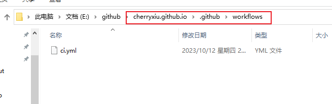
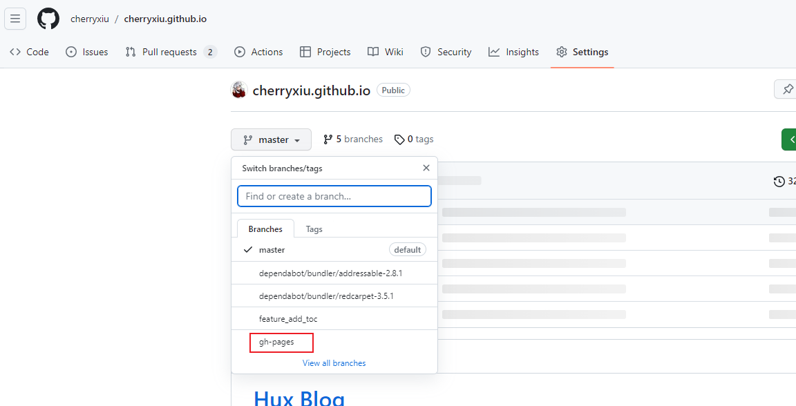
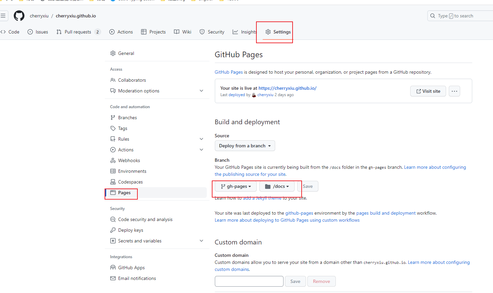

# 博客搭建

&emsp;&emsp;浅浅记录本博客搭建教程

## 环境

python3以上,  mkdocs，githubpage

## MkDocs 介绍

&emsp;&emsp;MkDocs 是一个快速、简单、快捷可用的静态网站（ssg）生成工具。一个用 Python 开发的静态站点生成器，可以非常简单快速的创建项目文档，配置文件简单。文档使用markdown书写，结构清晰。

## 安装

```
$ pip install mkdocs
```

## 初始化项目

```cmd
# 创建 my-project为项目名
$ mkdocs new my-project

# 切换目录
$ cd my-project

# 启动服务
$ mkdocs serve
# 可以绑定服务的ip和端口
$ mkdocs serve -a 0.0.0.0:8888  
```

命令执行后， 在浏览器中输入网址`http://127.0.0.1:8000/`，便可以看到网站内容。

## 主题配置

我使用的是 [material](https://squidfunk.github.io/mkdocs-material/)


## 发布至github-page

### 介绍

&emsp;&emsp;GitHub Pages 是一个免费的静态站点托管服务，它直接从 GitHub 上的仓库获取 HTML、CSS 和 JavaScript 文件，（可选）通过构建过程运行文件，然后发布网站。 还可以使用github免费提供的域名，再也不用为维护网站域名发愁了~

### 创建仓库

在 `github` 中创建一个新的仓库，命名为 `username.github.io` ，**username** 为你的 `github` 用户名

[搭建username.github.io](https://zhuanlan.zhihu.com/p/448782779)

此处省略本地项目与仓库建立联系的步骤......

### 配置自动部署

```cmd
# 创建目录
$ mkdir .github
$ cd .github
$ mkdir workflows
$ cd workflows
# 创建yml文件
$ touch ci.yml
```




ci.yml配置

```
name: ci 
on:
  push:
    branches:
      - master # 根据实际的分支情况设置，提交代码时部署
permissions:
  contents: write
jobs:
  deploy:
    runs-on: ubuntu-latest 
    steps:
      - uses: actions/checkout@v3
      - uses: actions/setup-python@v4
        with:
          python-version: 3.x
      - run: echo "cache_id=$(date --utc '+%V')" >> $GITHUB_ENV 
      - uses: actions/cache@v3
        with:
          key: mkdocs-material-${{ env.cache_id }}
          path: .cache
          restore-keys: |
            mkdocs-material-
      - run: pip install mkdocs-material 
      - run: mkdocs gh-deploy --force
```


也可使用 `mkdocs build` 构建，`site` 文件夹即为网站的文件。然后自行上传至个人网站

提交到 `github` 仓库，自动出现 `gh-deploy` 分支，为部署网站的分支。

更改部署分支，个人网站就搭建完成了~






访问 `https://cherryxiu.github.io/`

## 报错总结

### 无法与远程仓库建立连接

原来是本地的密钥是 `rsa` 算法生成的密钥，2022年之后需要更严格加密算法，可以更换 `ed22519`。

将 `C:\Users\Administrator\.ssh\id_ed25519.pub` 中内容，复制至 `Setttings > SSH and GDP Keys > New SSH key`

```
ssh-keygen -t ed25519 -C "your_email@example.com"
```

[SSH 密钥生成 GitHub 官方方法](https://docs.github.com/en/authentication/connecting-to-github-with-ssh/generating-a-new-ssh-key-and-adding-it-to-the-ssh-agent)

### connot find moudle minify

执行`pip install mkdocs-minify-plugin`

[mkdocs - Config value: ‘plugins‘. Error: The “minify“ plugin is not installed](https://blog.csdn.net/LostSpeed/article/details/127192772)

## 其他辅助工具

#### typora：编写文档

Typora是一款轻量级的Markdown编辑器, 所见即所得!

#### PicGo+GitHub搭建图床

[构建自己的图床：GitHub+PicGo+Typora自动上传 ](https://news.sohu.com/a/742731165_121096586)

[raw.githubusercontent.com与github什么关系](https://blog.csdn.net/The_Time_Runner/article/details/89737949)

使用typera自动插入图片，picgo会自动将图片上传至对应图床，并转换对应的地址，这样就不用考虑图片与文件之间的路径问题了。

例如：

``

