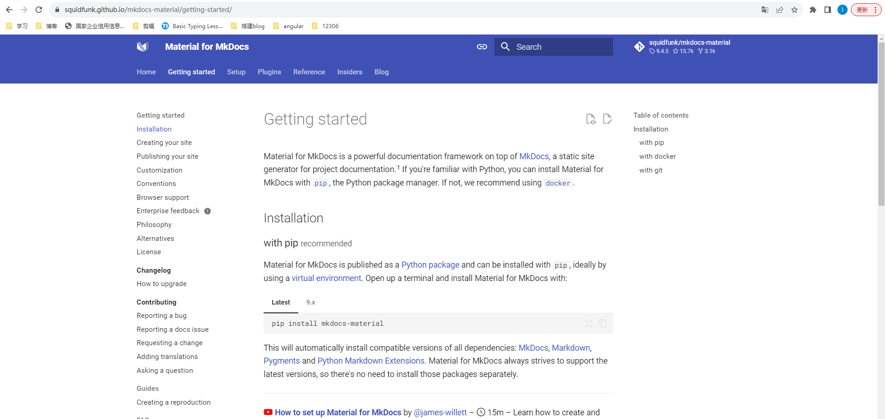

### 简介

##### git 工作区介绍


- 工作目录 working tree
- 缓存区 index
- 本地 git 仓库 repository
- 远端 git 仓库 repository



##### 工作主要流程

1. 修改文件都在工作目录 (working tree) 进行

2. `git add`执行后, 文件信息将会存储导缓存区（index）

3. 执行 `git commit` 后，修改文件提交到本地 git 仓库

4. 执行 `git push` 后，文件将从本地 git 仓库提交到远端仓库

   

##### 文件状态转变


- **Untracked**: 未跟踪, 此文件在文件夹中, 但并没有加入到 git 库, 不参与版本控制. 通过 `git add` 状态变为 Staged.
- **Unmodify**:  文件已经入库, 未修改, 即版本库中的文件快照内容与文件夹中完全一致. 这种类型的文件有两种去处, 如果它被修改, 而变为 Modified .如果使用 `git rm` 移出版本库, 则成为 Untracked 文件
- **Modified**: 文件已修改, 仅仅是修改, 并没有进行其他的操作. 这个文件也有两个去处, 通过 `git add` 可进入暂存staged状态, 使用 `git checkout` 则丢弃修改过, 返回到 unmodify 状态, 这个 `git checkout` 即从库中取出文件, 覆盖当前修改
- **Staged**: 暂存状态. 执行 `git commit` 则将修改同步到库中, 这时库中的文件和本地文件又变为一致, 文件为 Unmodify 状态. 执行 `git reset HEAD filename` 取消暂存,文件状态为Modified

### 1. 初始化本地仓库

```
$ git init
```

### 2. 添加远程仓库

```
$ git remote add origin https://github.com/username/repo.git
```

### 3. 每次每次提交和拉取时都要求输入用户名和密码

```
$ git config --global credential.helper store
```

### 4. 客户端设置或修改用户名和邮箱

```
$ git config --global user.name '用户名'
$ git config --global user.email '邮箱' 
```

### 5. 主分支修改, 同步更新子分支

```
主分支 dev 子分支 feature-1

rebase: 记录合并为一条线
$ git checkout feature-1
$ git rebase dev


merge 保存所有提交记录
$ git checkout feature-1
$ git merge dev
$ git push origin 


自己的操作,在 release_web_1.60.0_lx 分支上
暂存
$ git stash 
切换到主分支
$ git checkout release_web_1.60.0
拉取最新记录
$ git pull origin release_web_1.60.0
切换到个人分支
$ git checkout release_web_1.60.0_lx
合并主分支内容到个人分支
$ git merge release_web_1.60.0
提交到远程分支
$ git push origin release_web_1.60.0_lx
释放缓存区内容
$ git stash pop

直接在个人分支上同步主分支代码 --rebase 不产生新的节点
$ git pull --rebase origin release_web_1.60.0

git pull = git fetch + git merge
git pull --rebase = git fetch + git rebase
```

###  6. 创建分支

```
前提:  当前分支为 release_web_1.60.0

创建分支
$ git branch release_web_1.60.0_lx 
切换分支
$ git chekcout release_web_1.60.0_lx
创建并切换分支
$ git checkout -b release_web_1.60.0_lx
```

###  7. 删除分支

```
前提: 当前分支为 release_web_1.60.0, 删除 release_web_1.60.0_lx 分支

查看本地和远程分支
$ git branch -a
删除本地分支,会在删除前检查merge状态（其与上游分支或者与head）。
$ git branch -d release_web_1.60.0_lx
删除本地分支,是git branch --delete --force的简写，它会直接删除。
$ git branch -D release_web_1.60.0_lx
删除远程分支
$ git push origin --delete <BranchName>
```

### 8. 删除"本地跟踪远程分支 "

```
显示远程分支信息
$ git remote show origin
删除本地跟踪远程分支
$ git remote prune origin
```

### 9. reset 撤销add, commit 记录

```
已经commit, 不删除工作空间代码, 撤销add, commit
$ git reset --mixed HEAD^
已经commit, 删除工作空间代码, 撤销add, commit
$ git reset --hard HEAD^
已经commit, 不删除工作空间代码,撤销commit, 不撤销 add
$ git reset --soft HEAD^
已经add, 撤销add
$ git reset HEAD test.java
```


> ps:  异常
>
> 今天在使用git回退功能的时候，遇到以下错误：
>
> git reset --hard HEAD^：
>
> fatal: ambiguous argument 'HEAD^': unknown revision or path not in the working tree.
> Use '--' to separate paths from revisions, like this:
> 'git <command> [<revision>...] -- [<file>...]'
>
> 查了下原因可能有两种：
>
> 因为cmd控制台中换行符默认是^，而不是\ ，所以^符号被git编译为换行符了，解决方案：
> git reset --hard "HEAD^"
> git reset --hard HEAD~[return times]
> 该仓库到目前为止只有commit过一次代码，故已经是head版本，也会报这样的错，无需关心直接commit或者rm即可
> ————————————————
> 版权声明：本文为CSDN博主「嗷大人」的原创文章，遵循CC 4.0 BY-SA版权协议，转载请附上原文出处链接及本声明。
> 原文链接：https://blog.csdn.net/voledmort/article/details/100794005

### 10. 修改commit注释(待测试)

```
此时会进入默认vim编辑器，修改注释完毕后保存就好了。
$ git commit --amend
```


### 11. stash暂存

```
查看缓存区数据
$ git stash list
缓存
$ git stash
获取最近一次暂存内容, 并在暂存区中删除这个暂存信息
$ git stash pop
获取指定暂存数据后, 并不会删除暂存信息
$ git stash apply stash@{1}
清理最近一次暂存内容
$ git stash drop
清理指定某个暂存的内容
$ git stash  drop stash@{1}
清理暂存区所有数据
$ git stash clear

```

### 12. pull(拉取)

```
$ git pull = git fetch + git merge 
$ git pull --rebase = git fetch + git rebase
```

```
                 C5---C6---C7  feature
                /
        C1--- C2---C3---c4  master
           
   git checkout feature
   git merge master：生成新节点
                 C5---C6--C7---C8*  feature
                /            /
        C1--- C2---C3------c4  master
        
           
  git checkout feature
  git rebase master： 不生成新节点      
                        master
                         /
        C1--- C2---C3---c4---C5*---C6*---C7*  feature
```


`git merge` 不对仓库历史做任何改变，它会保留分支上所有的历史commit，然后简单地创建一个合并的commit。

rebase将feature分支的基移到master分支的开头(即c4)，将所有的新提交合并到主分支中。与在feature分支中创建合并提交不同，rebase通过在feature分支中为每个commit创建全新的commit来重写提交历史，*c5、*c6、*c7是在feature分支上的新commit。换句话说，就是在c4的基础上，依次重新提交在feature分支上的每一次修改。

### 13.revert,checkout,reset 回滚

https://www.cnblogs.com/liuyuelinfighting/p/16788088.html

- revert 反转

  > 中心思想是你改错了, 我帮你改回来

  用于撤销某个commit的修改

  撤销的方式是将该commit的修改做一个反向的修改后生成一个新的提交

  可以撤销**任何comit** , 包括最近的commit 和 中间某个commit

  (只能一个个commit撤销)

  ```
  $ git revert 4beb086
  改动的是工作区work directory 和 index 区
  $ git push 
  ```

  

- checkout

  > 若需要撤销最近10次的commit, 回滚到昨天晚上的版本, 则可以使用checkout
  >
  > 中心思想是你改错了, 我用老版本覆盖过来

  获取历史版本前需要先删除工作区所有内容(不删除会导致新增文件依然存在)

  获取到历史版本后, 就是正常的git提交流程 

  ```
  删除工作区内容
  $ rm -rf*
  检出89d4291到工作区
  $ git checkout 89d4291
  改动的只有工作区, 所以需要add, commit
  $ git add .
  $ git commit -m ""
  $ git push 
  ```

- reset

  > 直接抹掉修改的记录

  ```
  reset 后, 最新版本更新后89d4291
  $ git reset --hard 89d4291
  $ git reset --soft HEAD^
  
  --hard是最直接，最危险，同时也是使用最频繁的选项。当我们传入 --hard 执行 git reset 时，Commit History会被更新到指定的commit，同时暂存索引和工作目录也会被重置到对应commit的状态。这意味着，指定你工作目录和暂存索引里的内容会丢失
  --soft：保留工作目录，并把重置 HEAD 所带来的新的差异放进暂存区
  --mixed 是默认的选项。这种模式下，引用指针会更新。暂存索引被重置到指定commit的状态，任何暂存索引未提交的变更都会被移动到工作目录中，继续上面的例子。
  ```
  
  

### 14. cherry-pick(感觉wiki不太对)

检出分支B上某些commit到分支A上

### 15. rebase变基详解

https://blog.csdn.net/weixin_42310154/article/details/119004977

### 16. todo 待学习 merge 和 rebase

https://www.cnblogs.com/michael-xiang/p/13179837.html
