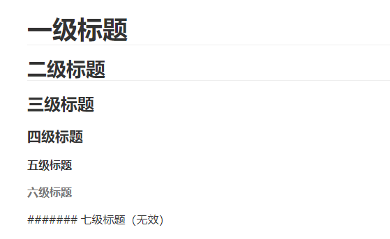

#  Markdown 语法

Markdown 是一个 Web 上使用的文本到 HTML 的转换工具，可以通过简单、易读易写的文本格式生成结构化的 HTML 文档。[Markdown在线编辑器](https://c.runoob.com/front-end/712/)

有时如果找不到markdown语法，可使用html标签来设置文本格式

## 标题

使用 `#` 后加空格，即出现标题样式。最后支持六级标题

```
# 一级标题
## 二级标题
### 三级标题
#### 四级标题
##### 五级标题
###### 六级标题
```



## 段落

### 1. 首行缩进

两个 `&emsp;`可实现首行缩进

### 2. 字体样式

```
* 斜体字*
_斜体字_
**粗体字**
__粗体字__
***粗斜体字***
___粗斜体字___
~~删除线~~
<u>下划线</u>

<font size=1>大小为1的字体</font>
<font size=6>大小为6的字体</font>
<font color=gray size=4>gray颜色的字</font>
<font color=green size=4>green颜色的字</font>
<font color=hotpink size=4>hotpink颜色的字</font>
<font color=LightCoral size=4>LightCoral颜色的字</font>
<font color=LightSlateGray size=4>LightSlateGray颜色的字</font>
<font color=orangered size=4>orangered颜色的字</font>
<font color=red size=4>red颜色的字</font>
<font color=springgreen size=4>springgreen颜色的字</font>
<font color=Turquoise size=4>Turquoise颜色的字</font>

```

*斜体字*<br>
_斜体字_<br>
**粗体字**<br>
__粗体字__<br>
***粗斜体字***<br>
___粗斜体字___<br>
~~删除线~~<br>

<u>下划线</u><br>

<font size=1>大小为1的字体</font><br>
<font size=6>大小为6的字体</font><br>
<font color=gray size=4>gray颜色的字</font><br>
<font color=green size=4>green颜色的字</font><br>
<font color=hotpink size=4>hotpink颜色的字</font><br>
<font color=LightCoral size=4>LightCoral颜色的字</font><br>
<font color=LightSlateGray size=4>LightSlateGray颜色的字</font><br>
<font color=orangered size=4>orangered颜色的字</font><br>
<font color=red size=4>red颜色的字</font><br>
<font color=springgreen size=4>springgreen颜色的字</font><br>
<font color=Turquoise size=4>Turquoise颜色的字</font>

### 3. 文本高亮

```
<mark>文本高亮</mark>
```

<mark>文本高亮</mark>

### 4. 分割线

```
***
* * *
******
- - -     <-- 短横线
_ _ _     <-- 下划线

```

***

* * * 

---

___

### 5. 脚注

```
这是测试脚注[^标识符]。

这是数字脚注[^1]。这是文字脚注[^文本脚注]

[^标识符]:标识符可以是数字或文本。但不能包含空格或制表符。  
[^1]:数字脚注测试说明。  
[^文本脚注]:文本脚注测试说明。
```


这是测试脚注[^标识符]。 这是数字脚注[^1]。这是文字脚注[^文本脚注] 

[^标识符]: 标识符可以是数字或文本。但不能包含空格或制表符。
[^1]: 数字脚注测试说明
[^文本脚注]: 文本脚注测试说明

### 6. 有序列表

数字加上 ` . `  号来表示，注意 ` . ` 号和实际内容之间需要加一个空格。

```
1. 有序列表项1
2. 有序列表项2
```

1. 有序列表项1
2. 有序列表项2

### 7. 无序列表

使用星号，加号或是减号作为标记。

```
* 列表项1
* 列表项2

+ 列表项1
+ 列表项2

- 列表项1
- 列表项2
```

* 列表项1
* 列表项2

+ 列表项1
+ 列表项2

- 列表项1
- 列表项2

### 8. 嵌套列表

只需要在子列表选项的前面添加 4 个空格即可。

```
* 无序列表1
    1. 有序列表1.1
    2. 有序列表1.2
* 无序列表2
    - 无序列表2.1
    - 无序列表2.2
```

* 无序列表
    1. 有序列表1.1
    2. 有序列表1.2
* 无序列表2
    - 无序列表2.1
    - 无序列表2.2

## 代码块

### 1. 区块

区块使用 `>` 符号，后面加上一个空格。

```
> 区块
> Markdown
```

> 区块
> Markdown

### 2. 区块嵌套

每一层嵌套加上 `>` 符号和空格

```
> 区块
> > 嵌套1
> > > 嵌套2
```

> 区块
> > 嵌套1
> > > 嵌套2

### 3. 行内代码块

直接使用反引号 将需要标记的内容包含起来即可即可。注意这里的反引号是键盘左上角的那个键。

```
需要将`特殊内容` 突出
```

需要将`特殊内容` 突出

### 4. 代码区块

使用三个反引号，可指定语言，在第一个单引号的结尾指定语言 `java`、`js` 、`sql` 等

````
```java
	print 'Hello World'
```
````

```java
print 'Hello World'
```

## 引入

### 1. 插入图片

在链接的前面添加感叹号 `!` ，然后在括号中添加替代文本，并在括号中添加图像资源的路径或URL。您可以选择在括号中的URL之后添加标题。

```

```

### 2. 为文字添加超链接

在中括号中添加文本，并在括号中填写跳转URL。

```
[markdown百度百科](https://baike.baidu.com/item/markdown/3245829?fr=ge_ala "悬浮提示")
```

[markdown百度百科](https://baike.baidu.com/item/markdown/3245829?fr=ge_ala "悬浮提示")

### 3. 网站和电子邮件

要将URL或电子邮件地址快速转换为链接，请将其括在尖括号中。

```
<https://markdown.p2hp.com>
<xxxx@email.com>
*<https://markdown.p2hp.com>*
```

<https://markdown.p2hp.com>

<xxxx@email.com>

*<https://markdown.p2hp.com>*

## 表格

要添加表格，请使用三个或多个连字符 ` —` 创建每列的标题，并使用竖线 `|` 分隔每列。要实现类似Excel文本的左对齐、居中、右对齐，只需要在连字符的左侧、两侧、右侧添加冒号 `:` 即可。

```
| 标题 | 标题 | 标题 |
| :--- | :---------: |------: |
| 居中 | 居中 | 居右|
| 居中 | 居中 | 居右|
```

| 标题 | 标题 | 标题 |
| :--- | :--: | ---: |
| 居中 | 居中 | 居右 |
| 居中 | 居中 | 居右 |
